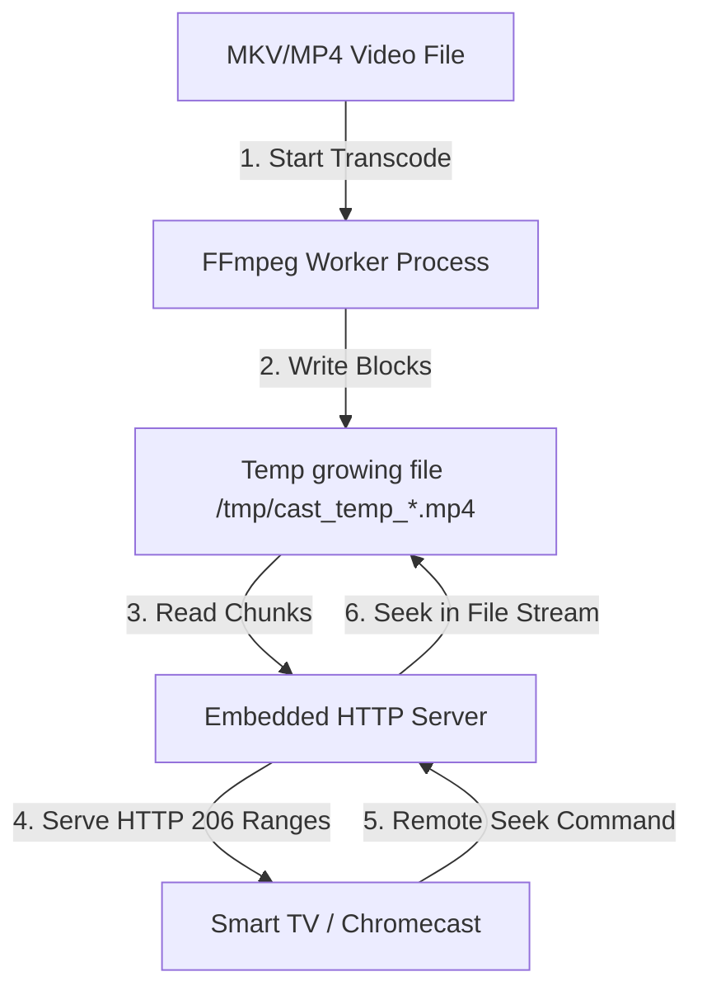

# 📺 Smart TV Cast Utility

A high-performance C# (.NET 10) console utility designed to cast static images and progressive videos (like MP4/WebM) to Google Cast-enabled devices (Chromecast, Google TV, Android TV) on your local wireless network. It can run interactively, take direct IP targets, or accept media piped from standard input (stdin) in a pipeline.

---

## 💡 Why This Tool Was Built

Standard Google Cast applications depend heavily on **multicast DNS (mDNS)** discovery. However, mDNS traffic is frequently dropped by wireless routers (due to AP isolation or IGMP snooping) or blocked when running applications inside containers, VMs, or under VPNs like Tailscale. 

To solve this, this utility combines multiple strategies:
1. **Parallel Multi-Interface mDNS Scan**: Searches all active multicast-capable network adapters.
2. **Direct TCP/REST Probing**: Probes targeted TV IPs on Google Cast ports (`8009` and `8008`) to resolve devices directly, bypassing mDNS entirely.
3. **Smart Local Route Resolution**: Uses UDP socket binding towards the TV IP to query the OS routing table and determine which local interface is actually routable to the TV, avoiding routing failures caused by VPNs/virtual adapters.
4. **VLC-Style Dynamic Transcode Caching**: For local video files, it transcodes to a temporary buffer in the background and serves byte-perfect HTTP 206 Range Requests, allowing native timeline scrubbing/seeking on the TV.
5. **Caching Read-Ahead Proxy Stream**: For piped streams, it replays pre-buffered bytes from memory to satisfy the Chromecast's multi-request connection sequence.
6. **Cache Busting**: Generates unique timestamped URLs for every cast request to bypass Chromecast's aggressive receiver cache.

---

## 🛠️ System Architecture



---

## 🚀 How to Run

### Prerequisite
* .NET 10 SDK (pre-configured on this system).
* `ffmpeg` and `ffprobe` (for on-the-fly transcoding and metadata detection).

### 1. Dynamic Seekable Local File Mode (VLC-Style)
Pass a local video file (MKV, MP4, AVI, WebM) directly to the command. The tool will spawn `ffmpeg` in the background to transcode the video stream to a temporary MP4 file in real-time, allowing **full seeking capabilities** using your TV remote, phone, or Google Home app:

```bash
# Using dotnet run
dotnet run -- "/var/home/maxfridbe/Videos/MaxFlix/Tri.kota.Zimnie.kanikuly.1080p-EniaHD.mkv"

# Using the compiled single binary
./bin/Release/net10.0/linux-x64/publish/cast-local "/var/home/maxfridbe/Videos/MaxFlix/Tri.kota.Zimnie.kanikuly.1080p-EniaHD.mkv"
```

### 2. Piped Progressive Live Mode
Pipe any PNG, JPG/JPEG, GIF, MP4, or WebM media file directly into the command. The tool will auto-detect the file type based on its magic bytes, start the HTTP server, and automatically cast to the TV (defaulting to `--cc 1`):

```bash
# Pipe a static image
cat nature_wallpaper.jpg | ./bin/Release/net10.0/linux-x64/publish/cast-local

# Transcode a movie on-the-fly and stream it progressively
ffmpeg -i "Tri.kota.Zimnie.kanikuly.1080p-EniaHD.mkv" -c:v copy -c:a aac -movflags frag_keyframe+empty_moov -f mp4 pipe:1 | ./bin/Release/net10.0/linux-x64/publish/cast-local --live --size 282000000
```

Options for live video streaming:
* `--live`: Force the utility to treat the input as a progressive live stream.
* `--size <bytes>`: Specify the estimated total size of the video stream in bytes (e.g., `--size 282000000` for 282MB) so that the TV can make standard range requests without chunked-encoding limitations.

### 3. Interactive Mode (Auto-Scan)
Scans network adapters and probes the Living Room TV (`192.168.50.109`) in parallel. If multiple displays are resolved, it displays a numbered menu:
```bash
./bin/Release/net10.0/linux-x64/publish/cast-local
```

### 4. Selector Mode (`--cc`)
Select a specific discovered device by its index when multiple options are present:
```bash
./bin/Release/net10.0/linux-x64/publish/cast-local --cc 1
```

### 5. Direct IP Mode
Manually specify the TV's IP address to bypass discovery completely:
```bash
./bin/Release/net10.0/linux-x64/publish/cast-local 192.168.50.109
```

---

## 📦 Compiling to Standalone Single Binary (No dotnet deps)

The project is pre-configured to build a **self-contained, single-file native executable** for Linux x64 that has zero external `.NET` dependencies. Trimming is disabled (`PublishTrimmed=false`) to prevent reflection errors inside the `GoogleCast` SDK.

To compile:
```bash
dotnet publish -c Release
```

The output binary will be generated at:
[cast-local](file:///var/home/maxfridbe/Dev/vibecoding/cast-local/bin/Release/net10.0/linux-x64/publish/cast-local) (approx. 75 MB).
