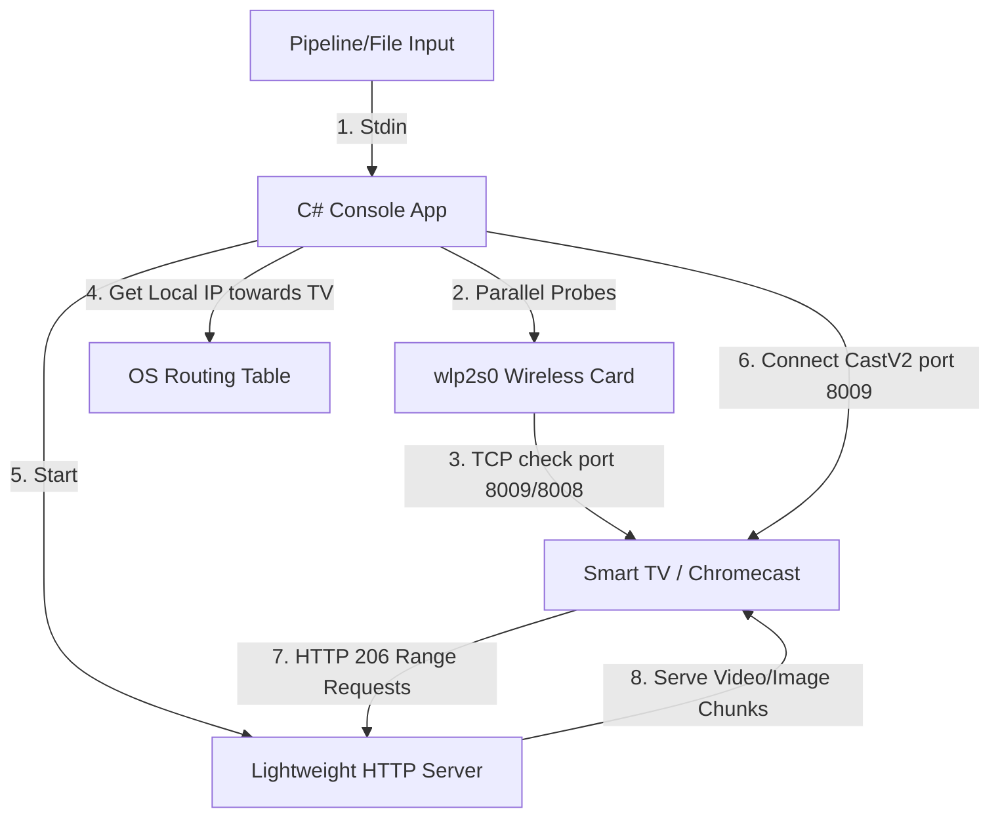

# 📺 Smart TV Cast Utility

A high-performance C# (.NET 10) console utility designed to cast static images and progressive videos (like MP4/WebM) to Google Cast-enabled devices (Chromecast, Google TV, Android TV) on your local wireless network. It can run interactively, take direct IP targets, or accept media piped from standard input (stdin) in a pipeline.

---

## 💡 Why This Tool Was Built

Standard Google Cast applications depend heavily on **multicast DNS (mDNS)** discovery. However, mDNS traffic is frequently dropped by wireless routers (due to AP isolation or IGMP snooping) or blocked when running applications inside containers, VMs, or under VPNs like Tailscale. 

To solve this, this utility combines multiple strategies:
1. **Parallel Multi-Interface mDNS Scan**: Searches all active multicast-capable network adapters.
2. **Direct TCP/REST Probing**: Probes targeted TV IPs on Google Cast ports (`8009` and `8008`) to resolve devices directly, bypassing mDNS entirely.
3. **Smart Local Route Resolution**: Uses UDP socket binding towards the TV IP to query the OS routing table and determine which local interface is actually routable to the TV, avoiding routing failures caused by VPNs/virtual adapters.
4. **Embedded HTTP range server**: Serves local files and stdin pipeline streams using HTTP 206 Partial Content (Range Requests), which is required by Chromecast's HTML5 video decoder to parse metadata indexes (like the `moov` atom in MP4s).
5. **Cache Busting**: Generates unique timestamped URLs for every cast request to bypass Chromecast's aggressive receiver cache.

---

## 🛠️ System Architecture



---

## 🚀 How to Run

### Prerequisite
* .NET 10 SDK (already pre-configured on this system).

### 1. Interactive Mode (Auto-Scan)
Scans network adapters and probes the Living Room TV (`192.168.50.109`) in parallel. If multiple displays are resolved, it displays a numbered menu:
```bash
dotnet run
```

### 2. Pipeline Mode (Piping Images & Videos)
Pipe any PNG, JPG/JPEG, GIF, MP4, or WebM media file directly into the command. The tool will auto-detect the file type based on its magic bytes, start the HTTP server, and automatically cast to the TV (defaulting to `--cc 1`):

```bash
# Pipe a static image
cat nature_wallpaper.jpg | dotnet run

# Pipe a video stream from the internet
curl -sL "https://samplelib.com/preview/mp4/sample-5s.mp4" | dotnet run
```

Options for live video streaming:
- `--live`: Force the utility to treat the input as a progressive live stream.
- `--size <bytes>`: Specify the estimated total size of the video stream in bytes (e.g., `--size 282000000` for 282MB) to let the TV fetch range requests accurately without chunked-encoding limitations.

### 3. Selector Mode (`--cc`)
Select a specific discovered device by its index when multiple options are present:
```bash
dotnet run -- --cc 1
```

### 4. Direct IP Mode
Manually specify the TV's IP address to bypass discovery completely:
```bash
dotnet run -- 192.168.50.109
```

---

## 📦 Compiling to Standalone Single Binary (No dotnet deps)

The project is pre-configured to build a **self-contained, single-file native executable** for Linux x64 that has zero external `.NET` dependencies. JIT, standard library, and all dependencies are bundled into the binary.

To compile:
```bash
dotnet publish -c Release
```

The output binary will be generated at:
[cast-local](file:///var/home/maxfridbe/Dev/vibecoding/cast-local/bin/Release/net10.0/linux-x64/publish/cast-local) (approx. 19 MB).

